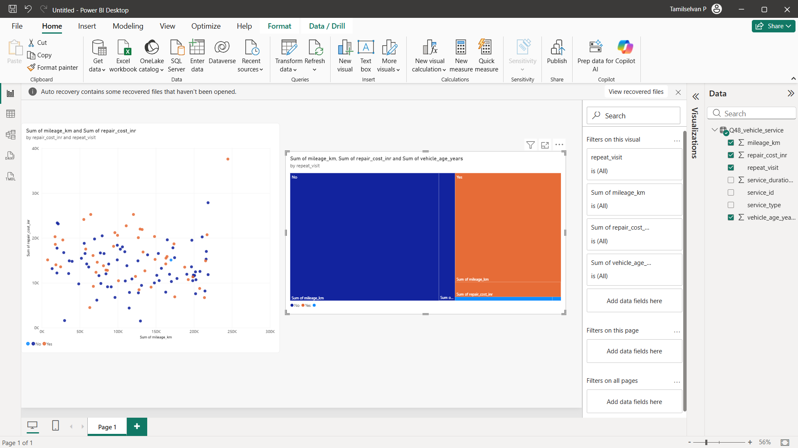

# Power BI Vehicle Service Analysis



## Power BI Dashboard

This project contains a **Power BI dashboard for vehicle service analysis**, visualizing mileage, repair costs, vehicle age, and repeat service visits.

### Dashboard Overview

* **Mileage vs Repair Cost Analysis** – Scatter plot showing the relationship between vehicle mileage and repair cost.
* **Repeat Visit Analysis** – Visual comparison of vehicles with and without repeat service visits.
* **Vehicle Age Analysis** – Includes vehicle age as part of the service analysis.
* **Service Cost Insights** – Helps identify patterns in repair costs and vehicle usage.

## Project Structure

```text
powerBI/
└── proof.png

README.md
```

## Dashboard Preview

The Power BI dashboard provides a visual representation of vehicle service data and helps analyze:

* Vehicle mileage
* Repair costs
* Vehicle age
* Repeat visits
* Service-related patterns

## Tools Used

* **Microsoft Power BI**
* **Data Visualization**
* **Power BI Scatter Chart**
* **Power BI Treemap**

## Proof

The screenshot above serves as proof of the Power BI dashboard implementation.
